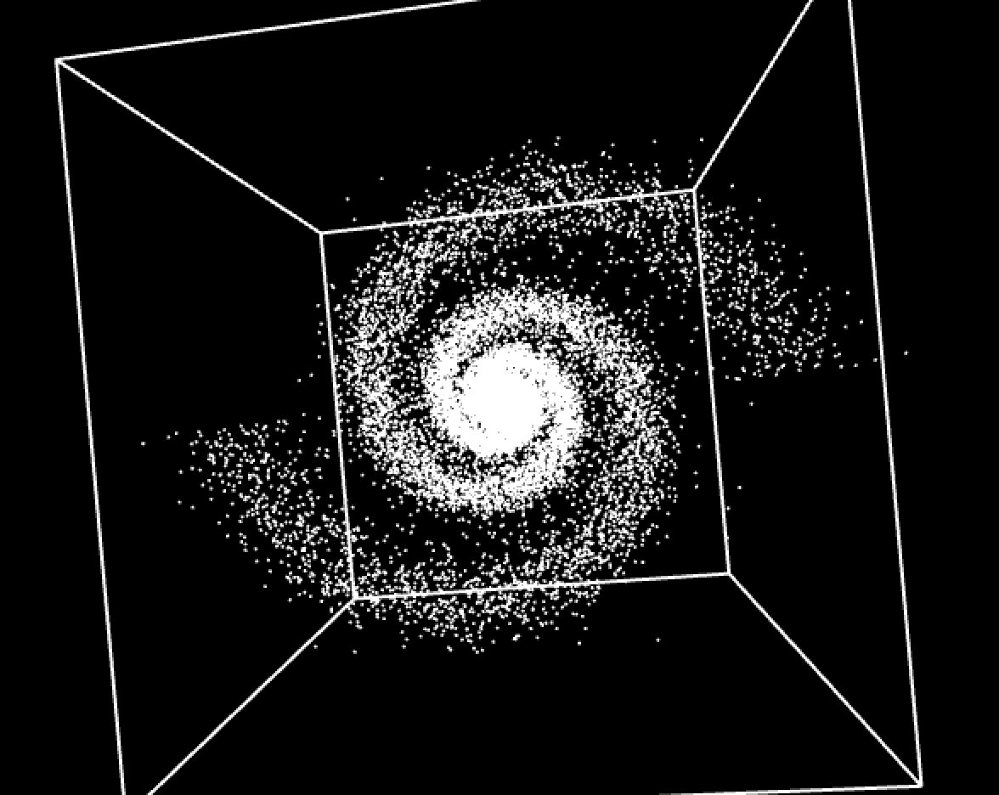
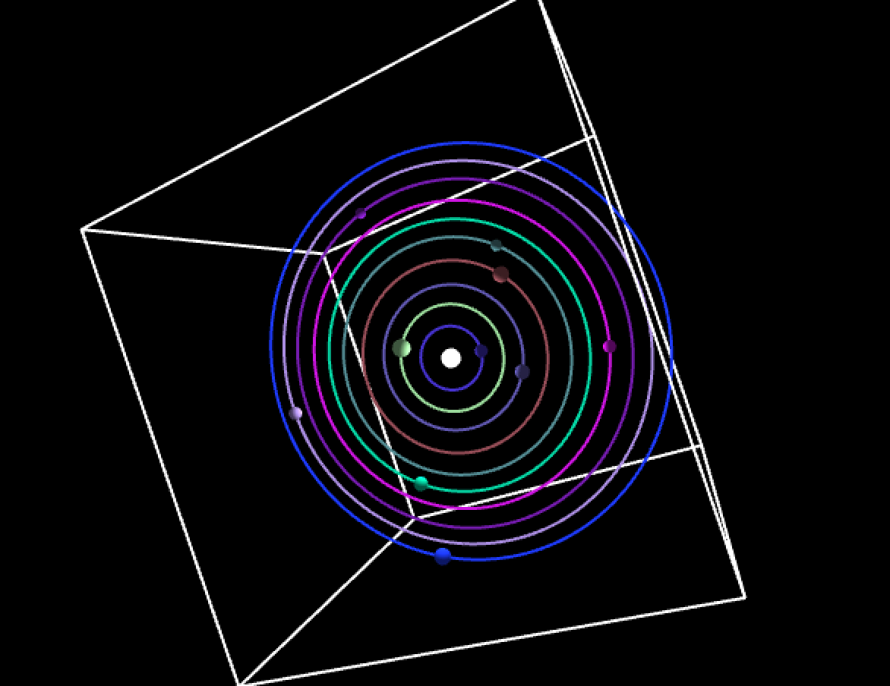

# Procedural Universe
Procedurally generated galaxies and star systems using Processing.

The main file is `procedural_universe.pde`. Open this file in Processing and click `Run` in order to view.

You can switch between which scene is rendered by uncommenting the calls to `drawme()` on lines 50 & 51.

## Galaxy

## Star System

